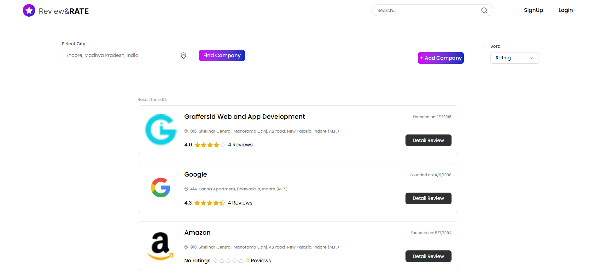
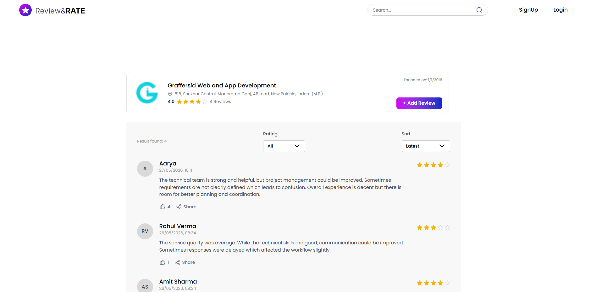
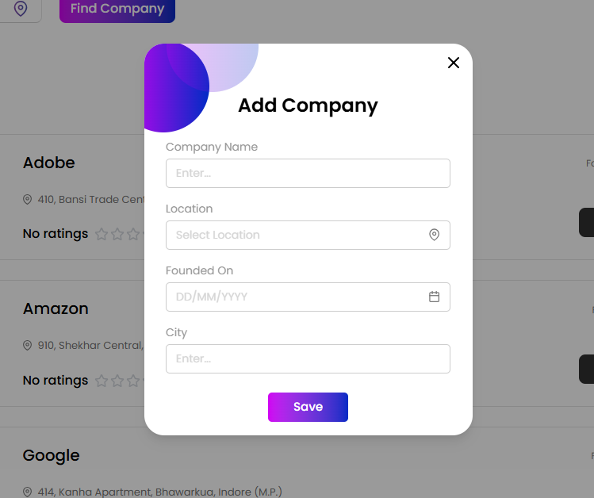
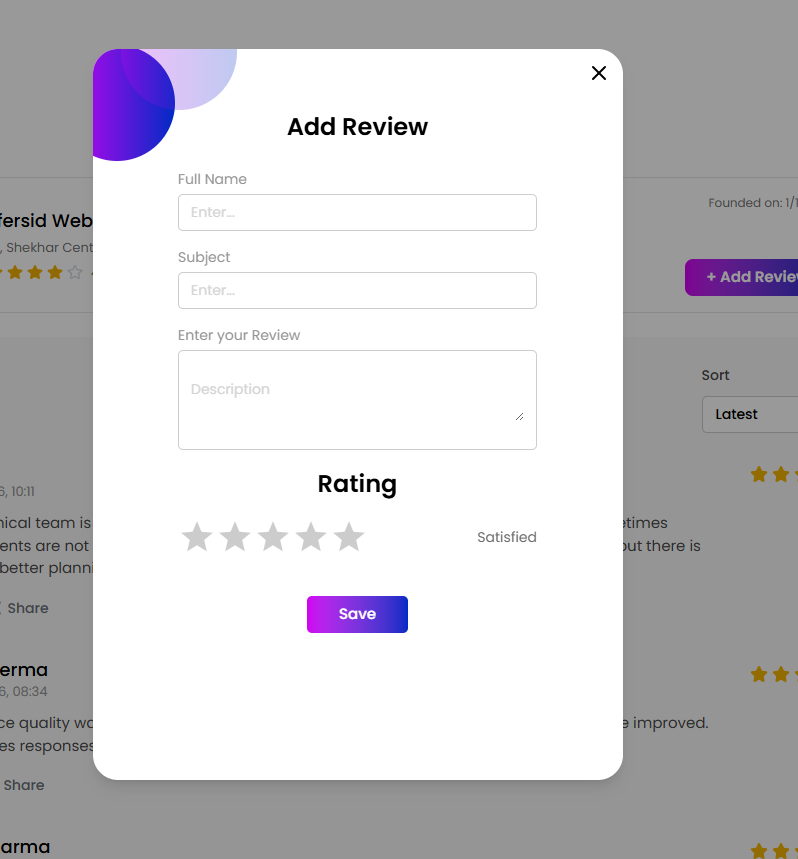

# Review & Rating Platform

A full-stack MERN application where users can:

- Search companies by city
- View company details
- Add companies
- Add reviews and ratings
- Filter reviews by rating
- Sort reviews
- Like reviews
- Share reviews

---

## Live Demo

Frontend:  
https://review-rating-platform-nine.vercel.app/

Backend API:  
https://review-rating-platform.onrender.com/

---

## Tech Stack

### Frontend
- React.js
- Tailwind CSS
- React Router DOM
- Axios
- React Icons

### Backend
- Node.js
- Express.js
- MongoDB Atlas
- Mongoose

### Deployment
- Frontend → Vercel
- Backend → Render

---

## Features

### Company Features
- Add new company
- Company listing
- Search companies by city
- Sort companies by:
  - Name
  - Average Rating
  - Reviews Count
  - Location

### Review Features
- Add review
- Rating system
- Like reviews
- Share reviews
- Filter reviews by rating
- Sort reviews by:
  - Latest
  - Oldest
  - Highest Rated
  - Lowest Rated

---

## Project Structure

```bash
review-rating-platform/
│
├── backend/
│
├── frontend/
│
├── screenshots/
│
└── README.md
```

## Environment Variables

### Frontend (.env)

```env
VITE_BASE_URL=https://review-rating-platform.onrender.com/api
```

### Backend (.env)

```env
MONGO_URI=your_mongodb_connection_string
PORT=4000
```

---

## Installation & Setup

### Clone Repository

```bash
git clone https://github.com/YOUR_USERNAME/review-rating-platform.git
```

---

## Backend Setup

```bash
cd backend
npm install
npm start
```

---

## Frontend Setup

```bash
cd frontend
npm install
npm run dev
```

---

## Screenshots

### Home Page


---

### Detail Page


---

### Add Company Modal


---

### Add Review Modal


